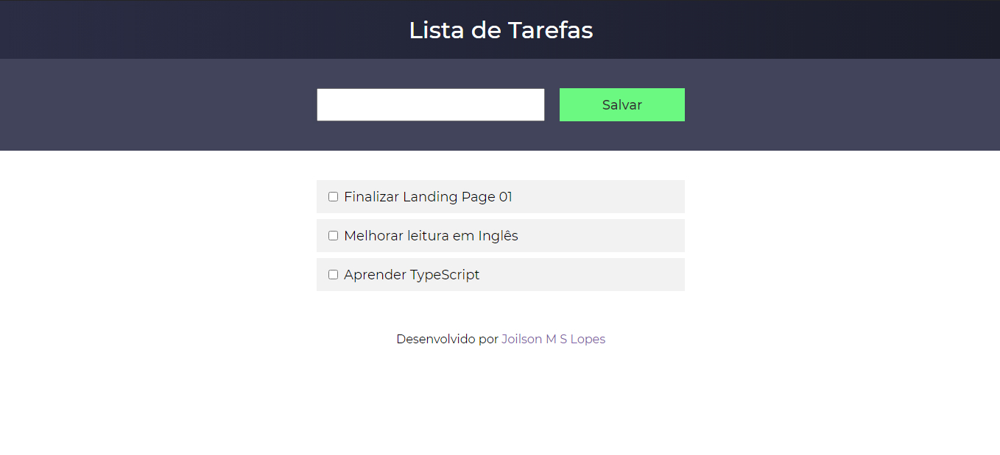

<h1 align="center">
  To-do list
</h1>



# Aplicação
Uma Lista de tarefas a fazer, onde o usuário pode adicionar uma nova task, pode marcar e desmarcar se está concluído e deletar task.

## Features implementadas
- Adicionar uma nova task
- Alterar task para concluído ou não concluído
- Dados são persistido no navegador do usuário

## Features a ser implementadas
[x] Deletar task<br>
[ ] Listar todas as tasks<br>
[ ] Listar apenas tasks concluídas<br>
[ ] Listar apenas tasks não concluídas

# Tecnologias
- ReactJS
- TypeScript
- Sass

## Executando o projeto

Utilize o **yarn** ou o **npm install** para instalar as dependências do projeto.
Em seguida, inicie o projeto.

```
yarn start
```

### **Projeto desenvolvido por**
[](https://www.linkedin.com/in/joilsonmslopes/)